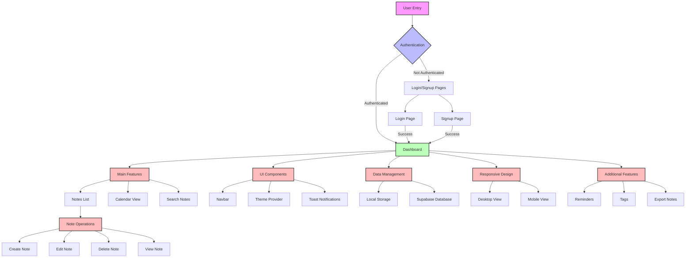

# NextNotes Application Flowchart

This flowchart illustrates the structure and flow of the NextNotes application.

## Detailed Feature Breakdown

### 1. Authentication System
- **User Entry (A)**
  - Initial access point to the application
  - Handles routing based on authentication state
  - Provides access to public features

- **Authentication Flow (B)**
  - Manages user session state
  - Implements secure token-based authentication
  - Handles session persistence
  - Provides automatic login for returning users

- **Login/Signup Pages (C)**
  - **Login Page (C1)**
    - Email/password authentication
    - Form validation
    - Error handling
    - "Remember me" functionality
    - Password reset option
  
  - **Signup Page (C2)**
    - New user registration
    - Email verification
    - Password strength requirements
    - Terms of service acceptance
    - Profile setup

### 2. Dashboard (D)
- **Central Hub**
  - Real-time note synchronization
  - User profile management
  - Settings configuration
  - Activity tracking

### 3. Main Features (E)
- **Notes List (E1)**
  - Sortable note list
  - Filter by tags/categories
  - Quick preview functionality
  - Drag-and-drop organization
  - Bulk actions support

- **Calendar View (E2)**
  - Monthly/weekly/daily views
  - Note scheduling
  - Reminder integration
  - Event color coding
  - Drag-and-drop scheduling

- **Search Notes (E3)**
  - Full-text search
  - Advanced filtering
  - Search history
  - Saved searches
  - Real-time search results

### 4. Note Operations (F)
- **Create Note (F1)**
  - Rich text editor
  - Template support
  - Auto-save functionality
  - Tag assignment
  - Reminder setting

- **Edit Note (F2)**
  - In-place editing
  - Version history
  - Collaborative editing
  - Format preservation
  - Auto-save

- **Delete Note (F3)**
  - Soft delete option
  - Trash bin functionality
  - Bulk delete
  - Recovery option
  - Permanent delete confirmation

- **View Note (F4)**
  - Full-screen view
  - Print functionality
  - Share options
  - Export capabilities
  - Reading mode

### 5. UI Components (G)
- **Navbar (G1)**
  - Responsive navigation
  - Quick actions menu
  - User profile access
  - Search integration
  - Notification center

- **Theme Provider (G2)**
  - Light/dark mode
  - Custom theme support
  - Color scheme customization
  - System theme sync
  - Per-user preferences

- **Toast Notifications (G3)**
  - Action confirmations
  - Error notifications
  - Success messages
  - Reminder alerts
  - System updates

### 6. Data Management (H)
- **Local Storage (H1)**
  - Offline support
  - Cache management
  - User preferences
  - Recent items
  - Draft saving

- **Supabase Database (H2)**
  - Real-time sync
  - Data backup
  - User data isolation
  - Query optimization
  - Security rules

### 7. Responsive Design (I)
- **Desktop View (I1)**
  - Two-column layout
  - Advanced features
  - Keyboard shortcuts
  - Multi-window support
  - Extended functionality

- **Mobile View (I2)**
  - Touch-optimized interface
  - Simplified navigation
  - Performance optimization
  - Offline capabilities
  - Mobile-specific features

### 8. Additional Features (J)
- **Reminders (J1)**
  - Custom reminder times
  - Repeat options
  - Notification preferences
  - Priority levels
  - Snooze functionality

- **Tags (J2)**
  - Custom tag creation
  - Color coding
  - Nested tags
  - Tag management
  - Bulk tag operations

- **Export Notes (J3)**
  - Multiple format support
  - Batch export
  - Custom templates
  - Compression options
  - Share integration

## Technical Implementation Details

### Frontend
- **Next.js Framework**
  - Server-side rendering
  - API routes
  - File-based routing
  - Image optimization
  - Performance optimization

- **React Components**
  - Functional components
  - Hooks implementation
  - Context API
  - Custom hooks
  - Component composition

- **Tailwind CSS**
  - Utility-first styling
  - Responsive design
  - Dark mode support
  - Custom theme
  - Animation utilities

- **Framer Motion**
  - Page transitions
  - Component animations
  - Gesture support
  - Animation orchestration
  - Performance optimization

### Backend
- **Supabase Integration**
  - Authentication
  - Real-time database
  - File storage
  - Row level security
  - Database functions

### Data Flow
1. User actions trigger state updates
2. Changes are synchronized with Supabase
3. Real-time updates are pushed to all connected clients
4. Local storage maintains offline functionality
5. Data is backed up automatically

### Security Features
- JWT authentication
- HTTPS encryption
- Data encryption at rest
- Input sanitization
- Rate limiting
- Session management

## Real-Time Updates Implementation

### Overview
The real-time update system in NextNotes is built using Supabase's real-time subscriptions feature, combined with React's state management and context API. This creates a seamless experience where changes made by any user are immediately reflected across all connected clients.

### Core Components

#### 1. Supabase Client Setup
```javascript
// src/lib/supabase.js
import { createClient } from '@supabase/supabase-js'

const supabaseUrl = process.env.NEXT_PUBLIC_SUPABASE_URL
const supabaseAnonKey = process.env.NEXT_PUBLIC_SUPABASE_ANON_KEY

export const supabase = createClient(supabaseUrl, supabaseAnonKey)
```

#### 2. Notes Context Provider
```javascript
// src/context/NotesContext.js
import { createContext, useContext, useState, useEffect } from 'react'
import { supabase } from '@/lib/supabase'

const NotesContext = createContext()

export function NotesProvider({ children }) {
  const [notes, setNotes] = useState([])
  const [loading, setLoading] = useState(true)
  const [error, setError] = useState(null)

  // Initial fetch of notes
  useEffect(() => {
    fetchNotes()
  }, [])

  // Set up real-time subscription
  useEffect(() => {
    const subscription = supabase
      .from('notes')
      .on('*', (payload) => {
        handleRealtimeUpdate(payload)
      })
      .subscribe()

    return () => {
      supabase.removeSubscription(subscription)
    }
  }, [])

  const fetchNotes = async () => {
    try {
      setLoading(true)
      const { data, error } = await supabase
        .from('notes')
        .select('*')
        .order('updated_at', { ascending: false })

      if (error) throw error
      setNotes(data || [])
    } catch (error) {
      setError(error.message)
    } finally {
      setLoading(false)
    }
  }

  const handleRealtimeUpdate = (payload) => {
    const { eventType, new: newRecord, old: oldRecord } = payload

    switch (eventType) {
      case 'INSERT':
        setNotes(prevNotes => [newRecord, ...prevNotes])
        break
      case 'UPDATE':
        setNotes(prevNotes => 
          prevNotes.map(note => 
            note.id === newRecord.id ? newRecord : note
          )
        )
        break
      case 'DELETE':
        setNotes(prevNotes => 
          prevNotes.filter(note => note.id !== oldRecord.id)
        )
        break
      default:
        break
    }
  }

  const value = {
    notes,
    loading,
    error,
    fetchNotes
  }

  return (
    <NotesContext.Provider value={value}>
      {children}
    </NotesContext.Provider>
  )
}

export function useNotes() {
  return useContext(NotesContext)
}
```

#### 3. Note Operations with Real-Time Updates
```javascript
// src/services/notes.js
import { supabase } from '@/lib/supabase'

export async function createNote(noteData) {
  const { data, error } = await supabase
    .from('notes')
    .insert([noteData])
    .select()
  
  if (error) throw error
  return data[0]
}

export async function updateNote(id, updates) {
  const { data, error } = await supabase
    .from('notes')
    .update(updates)
    .eq('id', id)
    .select()
  
  if (error) throw error
  return data[0]
}

export async function deleteNote(id) {
  const { error } = await supabase
    .from('notes')
    .delete()
    .eq('id', id)
  
  if (error) throw error
  return true
}
```

#### 4. Component Implementation
```javascript
// src/components/NotesList.js
import { useNotes } from '@/context/NotesContext'
import { createNote, updateNote, deleteNote } from '@/services/notes'

export default function NotesList() {
  const { notes, loading, error } = useNotes()
  const [selectedNote, setSelectedNote] = useState(null)

  const handleCreateNote = async () => {
    try {
      const newNote = {
        title: 'New Note',
        content: '',
        user_id: currentUser.id,
        created_at: new Date().toISOString(),
        updated_at: new Date().toISOString()
      }
      
      await createNote(newNote)
      // No need to manually update state - real-time subscription will handle it
    } catch (error) {
      console.error('Error creating note:', error)
    }
  }

  const handleUpdateNote = async (id, updates) => {
    try {
      await updateNote(id, {
        ...updates,
        updated_at: new Date().toISOString()
      })
      // No need to manually update state - real-time subscription will handle it
    } catch (error) {
      console.error('Error updating note:', error)
    }
  }

  const handleDeleteNote = async (id) => {
    try {
      await deleteNote(id)
      // No need to manually update state - real-time subscription will handle it
    } catch (error) {
      console.error('Error deleting note:', error)
    }
  }

  if (loading) return <div>Loading notes...</div>
  if (error) return <div>Error: {error}</div>

  return (
    <div className="notes-list">
      <button onClick={handleCreateNote}>New Note</button>
      {notes.map(note => (
        <div key={note.id} className="note-item">
          <h3>{note.title}</h3>
          <p>{note.content.substring(0, 100)}...</p>
          <div className="note-actions">
            <button onClick={() => setSelectedNote(note)}>Edit</button>
            <button onClick={() => handleDeleteNote(note.id)}>Delete</button>
          </div>
        </div>
      ))}
    </div>
  )
}
```

### How Real-Time Updates Work

1. **Subscription Setup**
   - When the NotesProvider component mounts, it establishes a WebSocket connection to Supabase
   - The subscription listens for all changes (`*`) to the 'notes' table
   - The subscription is maintained as long as the component is mounted

2. **Event Handling**
   - When a change occurs in the database, Supabase sends a payload with:
     - `eventType`: The type of change (INSERT, UPDATE, DELETE)
     - `new`: The new record (for INSERT and UPDATE)
     - `old`: The old record (for UPDATE and DELETE)

3. **State Management**
   - The `handleRealtimeUpdate` function processes these events
   - It updates the React state based on the event type:
     - INSERT: Adds the new note to the beginning of the list
     - UPDATE: Replaces the old note with the updated version
     - DELETE: Removes the deleted note from the list

4. **Optimistic Updates**
   - For better UX, the UI can be updated optimistically before the server confirms the change
   - If the server operation fails, the UI can be rolled back

5. **Conflict Resolution**
   - The system uses timestamps (`updated_at`) to handle concurrent edits
   - The most recent change always takes precedence
   - For collaborative editing, operational transformation or conflict-free replicated data types (CRDTs) could be implemented

### Performance Considerations

1. **Subscription Management**
   - Subscriptions are properly cleaned up when components unmount
   - The system uses a single subscription for all note changes
   - For large applications, more granular subscriptions could be used

2. **State Updates**
   - React's state updates are batched for performance
   - The system avoids unnecessary re-renders by using proper state management

3. **Offline Support**
   - Local storage caches notes for offline access
   - When the connection is restored, changes are synchronized

4. **Scalability**
   - The system can handle multiple concurrent users
   - Supabase's infrastructure scales automatically

### Security

1. **Row Level Security**
   - Supabase's Row Level Security (RLS) ensures users can only access their own notes
   - Policies are defined at the database level

2. **Authentication**
   - All real-time connections are authenticated
   - Unauthorized users cannot subscribe to changes

3. **Data Validation**
   - Input validation occurs both client-side and server-side
   - Malformed data is rejected before reaching the database 